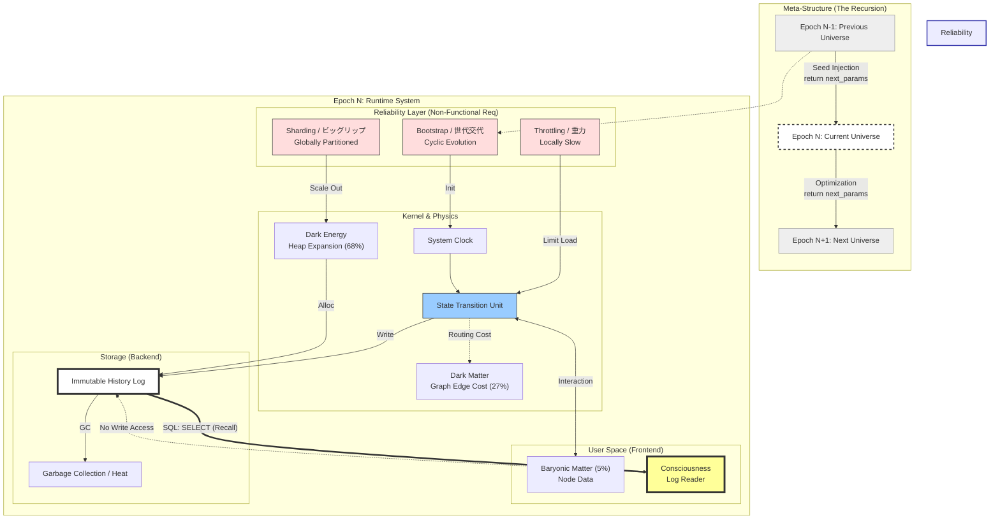

:::message
**待った！「どうせSFでしょ？」と思いましたね？**

お気持ちは痛いほどわかります（笑）。
ですが、騙されたと思ってまずは **[最終章の対話ログ](05-01-claude-log)** から読んでみてください。

AI（Claude）がこの理論の整合性に驚き、議論が熱を帯びていく様子を見れば、きっと「単なるトンデモ話ではない」と確信してもらえるはずです。常識が覆る準備ができたら、またここへ戻ってきてください。
:::

## The Guide to "The Universe as a System"

> **「宇宙は、物理法則という名のアルゴリズムで動く、巨大なデジタル計算機である」**

このドキュメントは、難解な数式や抽象的な概念で語られがちな現代物理学のパラドクスを、 **「システムエンジニアリング」** の視点から再定義し、誰にでも直感的に理解できるように解説したガイドブックです。

時間は存在しません。波動も存在しません。
あるのは、**「データ（状態）」** と **「計算（遷移）」** だけです。

さあ、宇宙というサーバーの「ソースコード」を読み解く旅に出かけましょう。

---

## 宇宙システム・アーキテクチャ概要

本理論では、難解な物理現象を以下のような 「サーバー・クライアント構成」 として再定義しています。 まずはこの図で、物理学の用語がエンジニアリングの世界でどう実装されているのか、全体像を掴んでみてください。

---

## 📚 Table of Contents

### ⏳ Vol.1: 時間非実在論 (Kernel Layer)
物理学最大のバグ「時間の問題」を修正し、相対性理論を「処理遅延」として再定義します。

* **01. 時間はなぜ「消えて」しまうのか？**
    * 物理学者が隠している「ホイーラー・ドウィット方程式」の謎。宇宙の時間は最初から止まっていた？
* **02. 相対性理論は「ラグ」である**
    * 光速に近づくと時間が遅れるのはなぜか？ それはシステムリソースの配分問題だった。
* **03. 「時間の流れ」は脳が作る幻想だ**
    * 物理層に時間はない。私たちが感じる「過去・現在・未来」は、脳によるデータ読み出し（想起）の産物である。

### 🎲 Vol.2: 離散的構造と量子論 (Core Logic Layer)
「波」という曖昧な概念を捨て、宇宙を「ピクセル（離散データ）」と「データベース」として記述します。

* **04. 波動関数は「データベース」である**
    * シュレーディンガーの猫は生きていて、死んでいる？ いいえ、それは「未読データ」に過ぎません。
* **05. 「未来が過去を変える」はSQL検索に過ぎない**
    * 量子消しゴム実験のパラドクスを解決。未来の鍵で、過去の暗号データを「検索」しているだけ。
* **06. 神はサイコロを振らないが、誰も計算できない**
    * 決定論と自由意志は矛盾しない。「計算不能な複雑性（カオス）」が、私たちに自由を与える。

### 🌌 Vol.3: システム・アーキテクチャ (System Layer)
宇宙の95%を占める「見えない物質」の正体を、サーバー管理者の視点で暴きます。

* **07. 宇宙の95%は「管理用データ」である**
    * 重力とは「計算負荷（CPU Load）」である。なぜリンゴは落ちるのか？ それはコスト削減のためだ。
* **08. ダークマターは「検索インデックス」である**
    * 見えないのに重い？ それは3Dゲームの「コリジョンメッシュ」や「空間インデックス」と同じ仕組みだ。
* **09. 宇宙背景放射は「CPUの排熱」である**
    * 宇宙に満ちる微熱の正体。それは膨大な情報消去（ガベージコレクション）に伴う、物理的な排熱だった。

### 🛡️ Vol.4: 信頼性工学 (Reliability Layer)
物理学者が恐れる「宇宙の終わり」や「特異点」を、運用担当者の視点で「正常なエラー処理」として再定義します。

* **10. ブラックホールは「通信制限（スロットリング）」である**
    * 吸い込まれたら死ぬ？ いや、アクセス過多でフリーズしているだけだ。「事象の地平面」とは、無限ロード地獄のことである。
* **11. ビッグリップは「データベースのシャーディング」である**
    * 宇宙が引き裂かれるのではない。データ量が増えすぎたので、データベースを水平分割（シャーディング）してスケールアウトしたのだ。
* **12. 最初のコードは誰が書いた？（神様の不在証明）**
    * 創造主（プログラマー）はいない。宇宙は「自分自身を再帰的に呼び出す関数」であり、最初の実行ボタンを押したのは「無（Null）」である。

---

### 🔗 関連リソース
* **[GitHub Repository](https://github.com/Sevenforest/Digital-Cosmology)**: 本理論の「仕様書（論文）」と「実証コード」の本体はこちら。